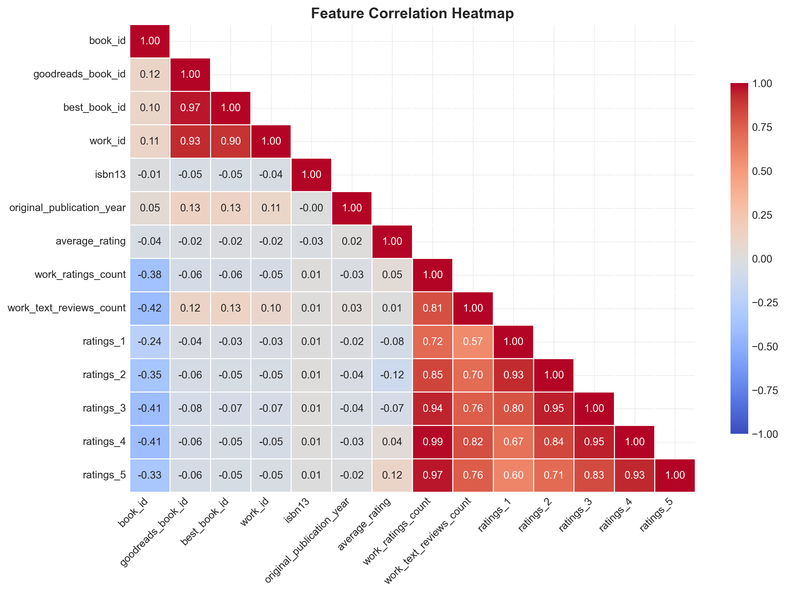
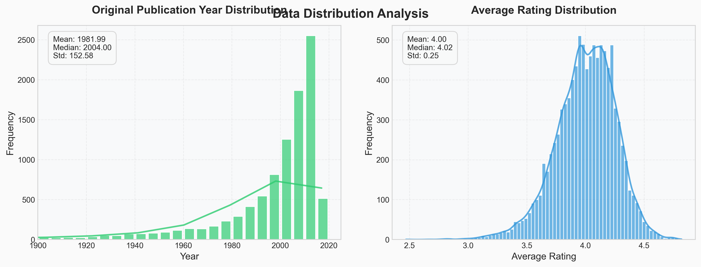

# Goodreads Book Dataset Analysis: A Data Story

## 1. Introduction & Data Overview

This report details the analysis of a Goodreads book dataset, aiming to uncover insights into book ratings, popularity, and trends. The dataset, sourced from `data\goodreads.csv`, comprises 10,000 book entries, each described by 21 features ranging from book IDs and titles to author information, average ratings, and rating distributions. With a data completeness score of 98.58%, the dataset provides a solid foundation for exploratory and advanced analytical techniques.  Missingness is primarily observed in `isbn`, `isbn13`, `original_title`, and `language_code` columns.

## 2. Analytical Journey

Our analytical journey began with an initial exploration phase, focusing on understanding the dataset's structure and characteristics.

*   **Basic Statistics:** We computed descriptive statistics for numerical columns, revealing the distribution of ratings, publication years, and rating counts.  For example, the average rating across all books is approximately 4.00, with significant variation in the number of ratings received by each book. The earliest publication year in the dataset is -1750, indicating potential data quality issues.
*   **Missing Values:** We identified columns with missing values, noting that `isbn`, `isbn13`, `original_title`, and `language_code` had the most significant gaps. This informed subsequent data cleaning and analysis strategies.

The analysis then progressed to more advanced techniques:

*   **Outlier Detection:** Employing outlier detection methods, we identified 940 potential outliers, representing 10% of the dataset. These outliers could indicate books with exceptionally high or low ratings compared to the average, or data entry errors.
*   **Clustering:** K-means clustering was applied to segment the books into distinct groups based on their features.  The resulting clusters varied significantly in size:
    *   Cluster 0: 383 samples (4.08%)
    *   Cluster 1: 2009 samples (21.38%)
    *   Cluster 2: 54 samples (0.57%)
    *   Cluster 3: 6920 samples (73.64%)
    *   Cluster 4: 31 samples (0.33%)

    Cluster 3 is the largest, suggesting a common profile among the majority of books.  Clusters 2 and 4 are very small, potentially representing niche categories or outliers not captured in the initial outlier detection.
*   **Principal Component Analysis (PCA):** PCA was performed to reduce the dimensionality of the data and visualize the book distribution in a lower-dimensional space. The first two principal components explained 43.53% and 20.80% of the variance, respectively.  A visualization of the PCA results was saved as `goodreads/pca_plot.png`.

Finally, we leveraged AI-assisted insights to suggest further avenues for exploration.

## 3. Key Findings

The analysis revealed several key findings:

*   **Rating Distribution:** The average book rating is around 4.00, suggesting a generally positive sentiment towards the books in the dataset. However, the standard deviation indicates significant variability.
*   **Outliers:** The presence of 10% outliers warrants further investigation. These could represent exceptionally popular or unpopular books, or data errors that need correction.
*   **Clustering:** The K-means clustering identified distinct book segments, with one large cluster representing the majority of books and several smaller clusters potentially representing niche categories. Understanding the characteristics of each cluster could inform targeted marketing or recommendation strategies.
*   **PCA:** The PCA visualization provides a simplified view of the book distribution, highlighting the most important dimensions of variation.  Further analysis of the principal components could reveal the underlying factors driving book popularity and ratings.

## 4. Recommendations & Next Steps

Based on the analysis, we recommend the following next steps:

1.  **Outlier Investigation:**  Thoroughly investigate the identified outliers to determine if they represent genuine exceptional cases or data errors. Correct any errors and consider a separate analysis of the "exceptional" books.
2.  **Cluster Profiling:**  Analyze the characteristics of each cluster in more detail. Identify the common themes, authors, or genres within each cluster to understand what differentiates them. This could involve examining the most frequent words in the book titles or descriptions.
3.  **PCA Interpretation:**  Examine the loadings of the principal components to understand which features contribute most to the variance in the data. This could reveal the key factors driving book popularity and ratings.
4.  **Further Analysis (as suggested by AI):**
    *   **Rating Distribution vs. Publication Year:** Explore how the distribution of ratings changes over time. Are older books rated differently than newer books?
    *   **Language Code Impact:** Analyze the impact of different languages on average rating and rating counts. Are books in certain languages generally rated higher or lower?
    *   **Author Analysis:** Identify the most prolific, highly rated, or widely read authors.

By pursuing these recommendations, we can gain a deeper understanding of the Goodreads book dataset and uncover actionable insights for authors, publishers, and readers.

## Supporting Visualizations

### Correlation Heatmap

### Distribution Plots

### PCA Plot

