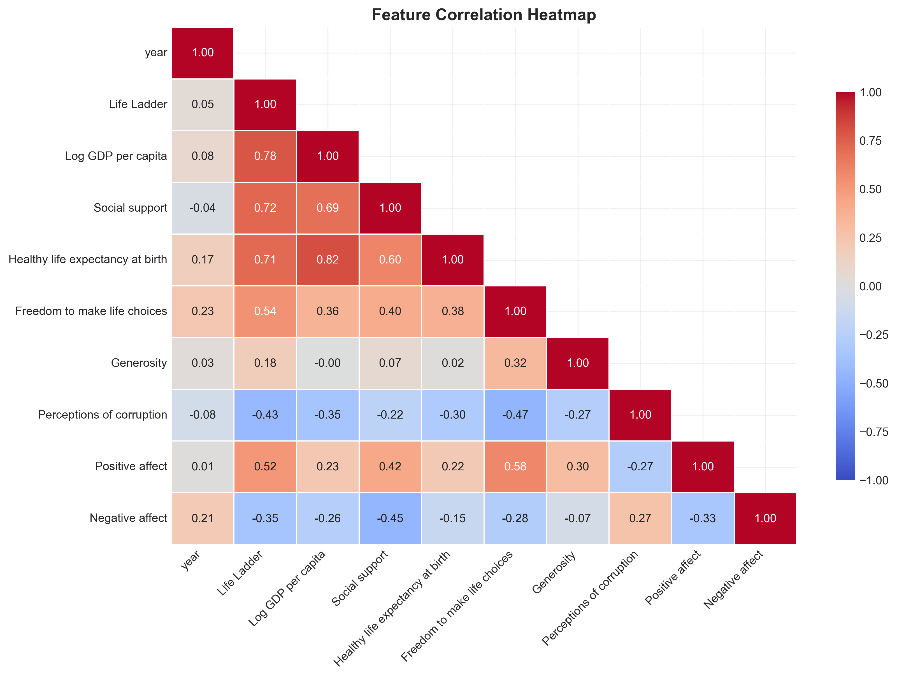
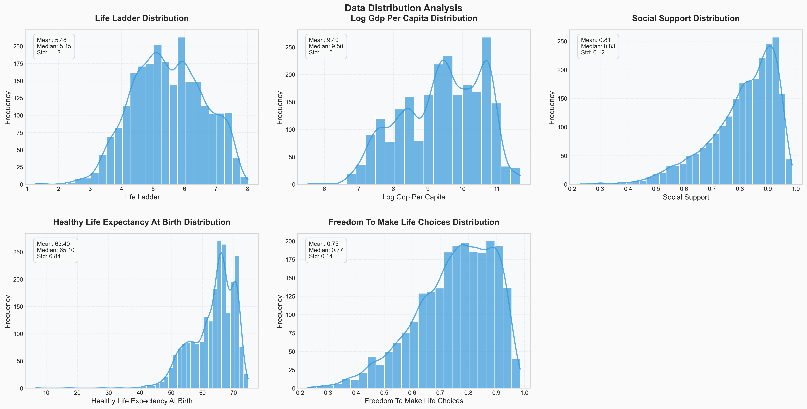

# Happiness Report: A Data-Driven Exploration of Global Well-being

## 1. Introduction & Data Overview

This report delves into the factors influencing global happiness, leveraging the 'happiness.csv' dataset. This dataset comprises **2363 rows and 11 columns**, offering a rich collection of data points spanning multiple countries and years. The dataset exhibits a high degree of completeness, with an overall **data completeness rate of 98.51%**. This makes it a robust foundation for exploring the intricate relationships between various socio-economic indicators and reported life satisfaction. The columns include country name, year, life ladder (happiness score), log GDP per capita, social support, healthy life expectancy, freedom to make life choices, generosity, perceptions of corruption, positive affect, and negative affect.

## 2. Analytical Journey

Our analytical journey began with an initial exploration of the dataset to understand its structure and characteristics. This involved:

*   **Basic Statistics:** We calculated descriptive statistics (mean, standard deviation, min, max, quartiles) for each numerical column. This provided a preliminary understanding of the distribution and range of values for each variable. For example, the average 'Life Ladder' score is approximately 5.48, with a standard deviation of 1.13, indicating a considerable variation in happiness levels across the globe.
*   **Missing Value Identification:** We identified and quantified missing values in each column. 'Perceptions of corruption' had the highest number of missing values (125), followed by 'Generosity' (81) and 'Healthy life expectancy at birth' (63). Addressing these missing values is crucial for ensuring the accuracy and reliability of subsequent analyses.

Following the initial exploration, we proceeded with more advanced analytical techniques:

*   **Outlier Detection:** We employed outlier detection methods to identify data points that deviate significantly from the norm. This revealed **210 potential outliers**, representing approximately 10.01% of the data. These outliers could represent unusual circumstances or data entry errors and warrant further investigation.
*   **Clustering Analysis:** We applied K-means clustering to group countries based on their happiness-related characteristics. The analysis resulted in five distinct clusters:
    *   Cluster 0: 372 samples (17.74%)
    *   Cluster 1: 284 samples (13.54%)
    *   Cluster 2: 337 samples (16.07%)
    *   Cluster 3: 737 samples (35.15%)
    *   Cluster 4: 367 samples (17.50%)
    Further analysis is needed to characterize these clusters and understand the factors that differentiate them.
*   **Principal Component Analysis (PCA):** We performed PCA to reduce the dimensionality of the dataset and identify the principal components that explain the most variance in the data. The first two principal components explain **42.15% and 15.10%** of the variance, respectively. A visualization of the PCA results was generated and saved as 'happiness/pca\_plot.png'.

Finally, we leveraged AI-assisted insights to generate further analysis suggestions and visualization ideas.

## 3. Key Findings

The analysis revealed several key findings:

*   **Significant Variation in Happiness:** There is a considerable variation in 'Life Ladder' scores across countries, suggesting that happiness is influenced by a complex interplay of factors.
*   **Missing Data Concerns:** The presence of missing values, particularly in 'Perceptions of corruption' and 'Generosity', highlights the need for careful data handling and potential imputation strategies.
*   **Outliers Present:** The identification of outliers suggests the presence of unusual circumstances or potential data errors that require further investigation.
*   **Distinct Country Clusters:** The clustering analysis revealed distinct groups of countries with similar happiness-related characteristics, indicating that regional or socio-economic factors may play a significant role in determining happiness levels.
*   **PCA Dimensionality Reduction:** PCA successfully reduced the dimensionality of the dataset while retaining a significant portion of the variance, suggesting that a smaller number of underlying factors can explain much of the variation in happiness.

## 4. Recommendations & Next Steps

Based on the analysis, we recommend the following next steps:

*   **Address Missing Values:** Implement appropriate strategies for handling missing values, such as imputation or deletion, depending on the nature and extent of the missing data.
*   **Investigate Outliers:** Conduct a thorough investigation of the identified outliers to determine their cause and whether they represent genuine anomalies or data errors.
*   **Characterize Clusters:** Analyze the characteristics of each cluster to identify the factors that differentiate them and gain insights into the drivers of happiness in different regions or socio-economic groups.
*   **Time Series Analysis:** Perform time series analysis of 'Life Ladder' scores for individual countries or groups of countries to identify trends and patterns in happiness over time. This can reveal how life satisfaction has changed and identify countries that have improved or declined significantly.
*   **Correlation Analysis:** Conduct a correlation analysis to identify the factors that are most strongly associated with 'Life Ladder'. This can help prioritize interventions and policies aimed at improving happiness levels.
*   **Regression Analysis:** Perform regression analysis to quantify the impact of various factors on 'Life Ladder'. This can help understand how much each independent variable (e.g., GDP, social support) contributes to the variation in 'Life Ladder'.
*   **Interactive Visualizations:** Create interactive visualizations to explore the relationships between different variables and gain a deeper understanding of the data. For example, a scatter plot of 'Life Ladder' vs. 'Log GDP per capita', colored by region, can reveal regional trends in the relationship between economic prosperity and happiness. A box plot of the distribution of 'Life Ladder' by year can show how happiness scores have changed over time.
*   **Region Mapping:** Create a 'Region' column based on the 'Country name' to facilitate regional analysis and visualization.
*   **Causation vs. Correlation:** Remember that correlation does not imply causation. Even if two variables are strongly correlated, it doesn't necessarily mean that one causes the other.
*   **Multicollinearity:** In the regression analysis, check for multicollinearity among the independent variables. High multicollinearity can inflate the standard errors of the coefficients, making it difficult to interpret the results.
*   **Assumptions of Regression:** Regression analysis has certain assumptions (linearity, independence of errors, homoscedasticity, normality of errors). It's important to check these assumptions to ensure the validity of the results.
*   **Feature Engineering:** Consider creating new features from existing ones. For example, you could calculate the change in 'Life Ladder' from one year to the next for each country.

By pursuing these next steps, we can gain a more comprehensive understanding of the factors that influence global happiness and develop evidence-based strategies for improving well-being around the world.

## Supporting Visualizations

### Correlation Heatmap

### Distribution Plots

### PCA Plot

