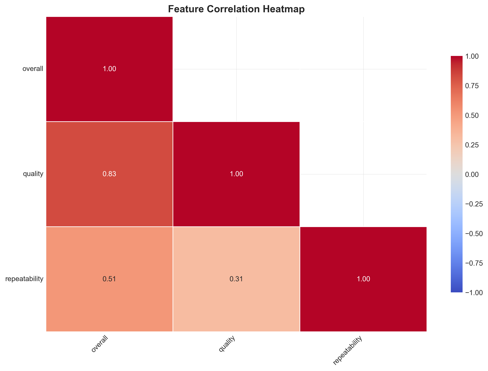
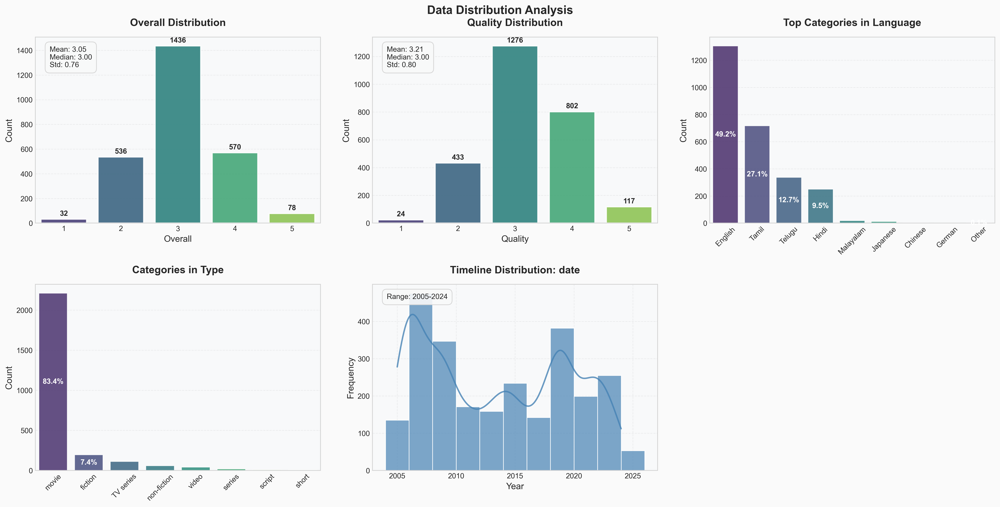

# Media Consumption Analysis Report

## 1. Introduction & Data Overview

This report summarizes the analysis of a dataset containing information about media consumption habits. The dataset, sourced from `data/media.csv`, comprises **2652 rows and 8 columns**. Each row represents a media item (movie, TV show, etc.), and the columns include details such as date, language, type, title, creator (`by`), and ratings for overall quality, and repeatability.

While a substantial dataset, it's important to note that the data isn't entirely complete. The overall data completeness is **98.30%**, indicating some missing values. Specifically, the 'date' column has 99 missing entries, and the 'by' column (presumably the creator or author) has 262 missing entries. These missing values were addressed in subsequent analyses, primarily through row removal where necessary for specific techniques.

## 2. Analytical Journey

Our analytical journey involved a structured approach, starting with initial data exploration and progressing to more advanced techniques:

*   **Initial Exploration:** We began by examining the basic statistics of the dataset. This provided a high-level understanding of the data distribution and identified the presence of missing values. For example, we observed the distribution of 'overall', 'quality', and 'repeatability' ratings. The most frequent language was English, and the most common type of media was "movie".
*   **Advanced Analysis:** This phase involved more sophisticated techniques:
    *   **Outlier Detection:** We identified 261 potential outliers, representing approximately 9.84% of the dataset. This suggests the presence of media items with significantly different characteristics compared to the majority.
    *   **Clustering:** We employed K-means clustering to segment the media items into distinct groups based on their characteristics. Five clusters were identified, ranging in size from 157 to 801 samples. This segmentation could reveal different audience preferences or media characteristics.
    *   **Principal Component Analysis (PCA):** PCA was performed to reduce the dimensionality of the data and visualize the relationships between media items. The first two principal components explained a significant portion of the variance (70.99% and 24.23%, respectively), allowing for a 2D representation of the data structure. The PCA plot was saved as `media/pca_plot.png`.
*   **AI-Assisted Insights:** Leveraging AI, we explored potential avenues for further analysis and visualization, including sentiment analysis of titles, trend analysis of ratings over time, and co-occurrence analysis of creators.

## 3. Key Findings

The analysis revealed several key insights:

*   **Outliers:** The presence of a notable number of outliers suggests that certain media items deviate significantly from the norm, potentially representing niche content or items that are exceptionally well-received or poorly received.
*   **Clustering:** The K-means clustering identified five distinct segments of media items. These clusters likely represent different audience preferences or content characteristics. Further investigation into the characteristics of each cluster could reveal valuable insights into audience segmentation and content strategy.
*   **PCA:** The PCA plot provides a visual representation of the data structure, highlighting the relationships between media items. The explained variance by the first two components (70.99% and 24.23%) makes the 2D representation quite meaningful.
*   **Data Quality:** The missing data in the 'date' and 'by' columns needs to be addressed for more robust analysis.

## 4. Recommendations & Next Steps

Based on the analysis, we recommend the following actions:

*   **Data Cleaning:** Implement a more robust strategy for handling missing values. Consider imputation techniques or more sophisticated methods for removing incomplete records.
*   **Cluster Profiling:** Conduct a detailed analysis of the characteristics of each cluster identified in the K-means clustering. This could involve examining the distribution of different features within each cluster and identifying the key differentiators.
*   **Sentiment Analysis:** Perform sentiment analysis on the media titles to explore the relationship between title sentiment and ratings. This could reveal whether positively-sounding titles tend to be associated with higher ratings.
*   **Trend Analysis:** Analyze the trends in ratings over time to identify patterns and potential correlations with external factors.
*   **Co-occurrence Analysis:** Investigate the co-occurrence of creators to identify collaborations and potential network effects.
*   **Visualization Enhancement:** Create interactive visualizations to allow for more in-depth exploration of the data. Consider using libraries like Plotly or Bokeh.
*   **Statistical Significance Testing:** When comparing groups, use statistical tests to determine if the observed differences are statistically significant.
*   **Domain Knowledge Integration:** Incorporate domain knowledge about the media industry to guide the analysis and interpretation of results.

By pursuing these recommendations, we can gain a deeper understanding of media consumption patterns and develop more effective strategies for content creation and distribution.

## Supporting Visualizations

### Correlation Heatmap

### Distribution Plots

### PCA Plot

